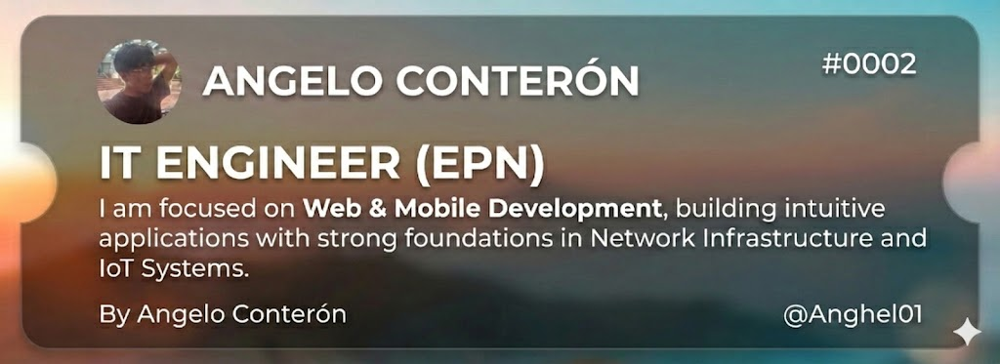
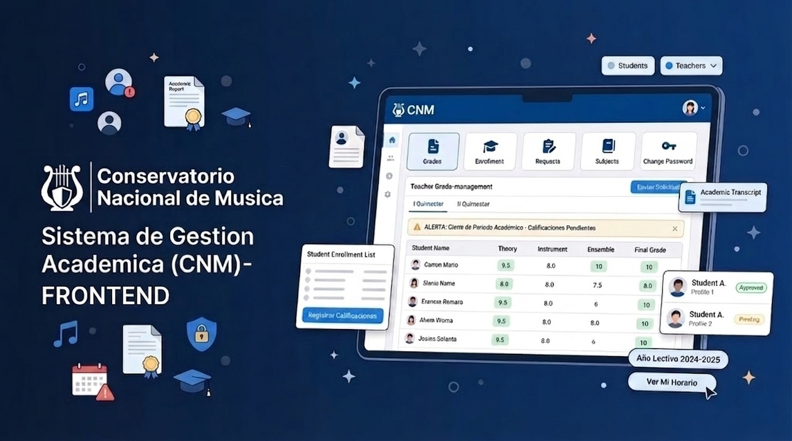
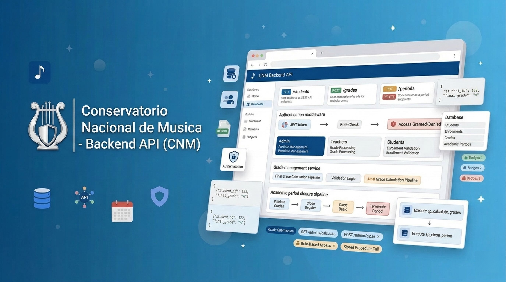

<table width="100%" border="0">
<tr>
<td width="20%" align="center">
  
</td>
<td width="80%">
  
</td>
</tr>
</table>

<h3 align="center">👋 Hi there! Welcome to my GitHub profile!</h3>

  

  
  
  

  <i>"Transforming ideas into systems and bits into experiences."</i> 🚀

  
  

## 🚀 About Me

<table>
<tr>
<td>

💻 **Technical Core**  
Solid foundation in **React.js**, **Java**, and **MySQL**, focused on robust and scalable solutions.

📚 **Continuous Learning**  
Diving into **Cloud Infrastructure**, **Cyber-security**, **Mobile Dev** and **AI Integration**.

</td>
<td>

🤝 **Collaborative & Proactive**  
Open Source contributor, team player, and problem solver.

🎨 **Creative Engineering**  
Background in **drawing** ✏️ — my secret weapon for **UI/UX Design**. Systems that are as beautiful as they are functional.

</td>
</tr>
</table>

## 💻 Technologies

#### 🚀 Software Development (Web & Mobile)

  

#### 📡 Networking & IoT Systems

  

#### 🛠️ Tools & UI/UX Design

  

## 📊 GitHub Stats

  
  &nbsp;
  
  &nbsp;
  

  

  

  

  

## 📌 Featured Projects

<table>
<tr>
<td width="50%">
<h3>🗺️ FestiMap Ecuador</h3>

> Web and mobile platform to discover festivals in Ecuador, plan cultural routes, and manage your event agenda.

        

   
</td>
<td width="50%">
<h3>🖥️ Academic Management System</h3>

> React web platform to manage academic modules, grades, and real-time alerts for the National Music Conservatory.

      

   
</td>
</tr>
<tr>
<td width="50%">
<h3>⚙️ Academic API — CNM Backend</h3>

> REST API built with Node.js and MySQL featuring JWT auth, business rules, and automated academic closing via scheduler.

       

   
</td>
<td width="50%">
<h3>🥊 CartoonFighter</h3>

> 2D action-survival game built with Unity and C#. Fast-paced combat with cartoon-style characters and WebGL export ready to play in browser.

    

   
</td>
</tr>
</table>

